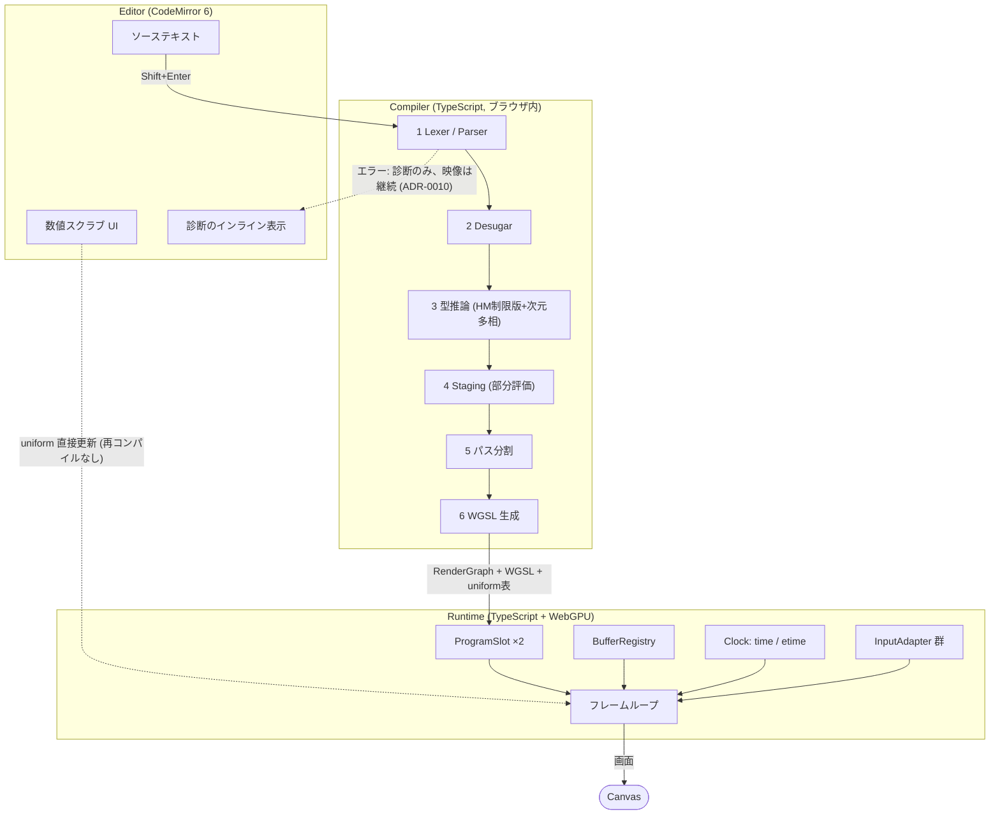
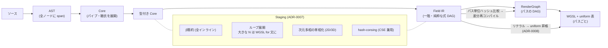
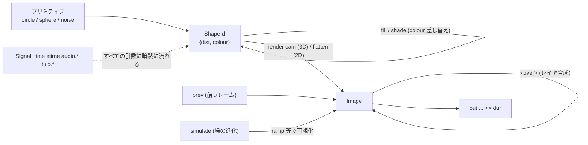
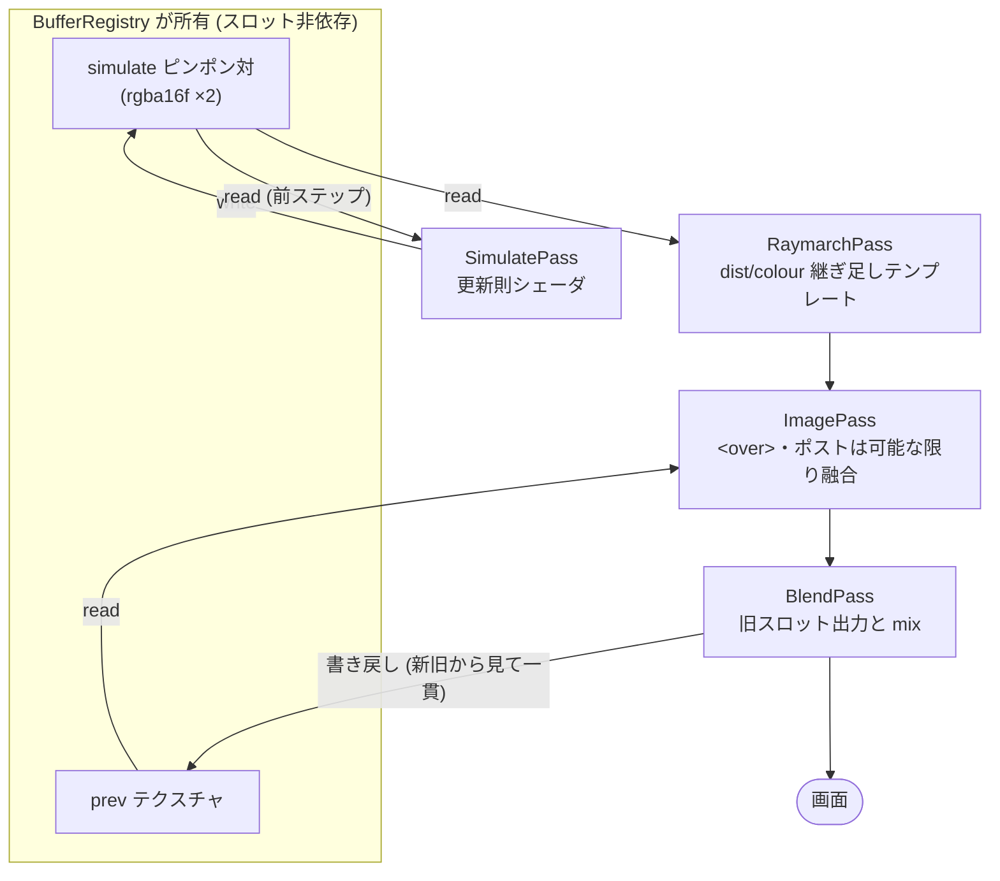
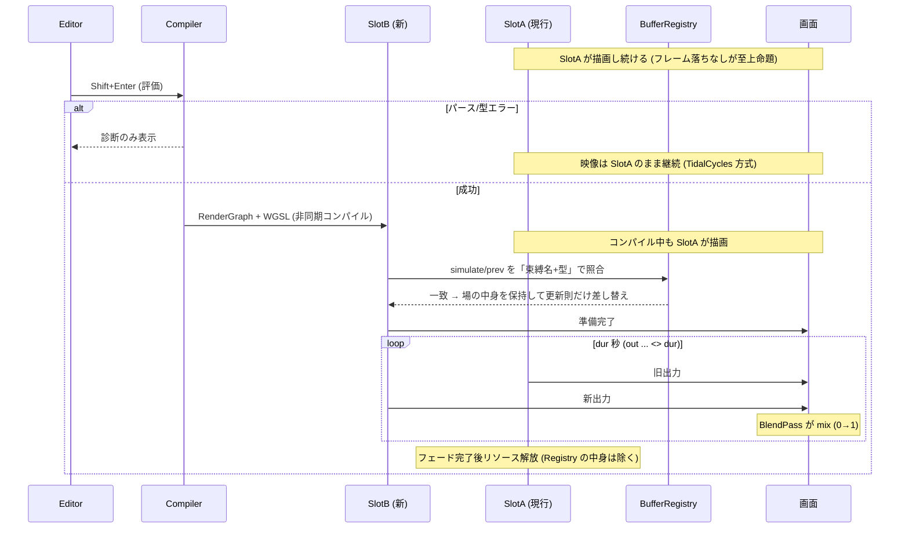
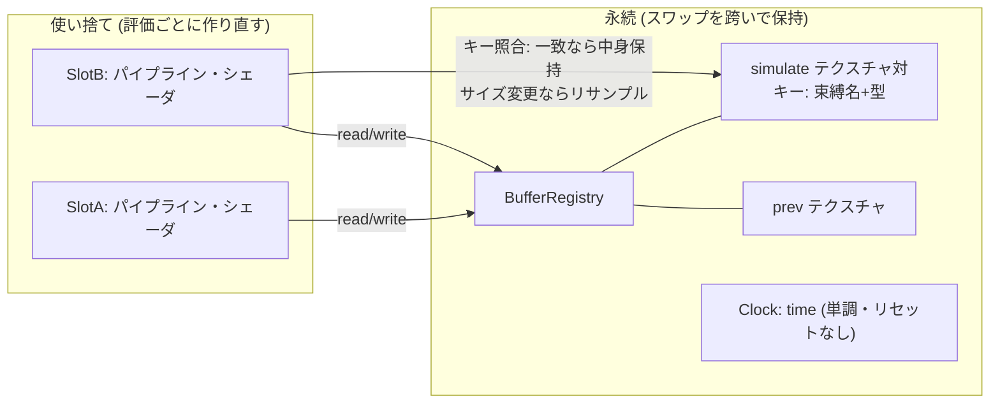
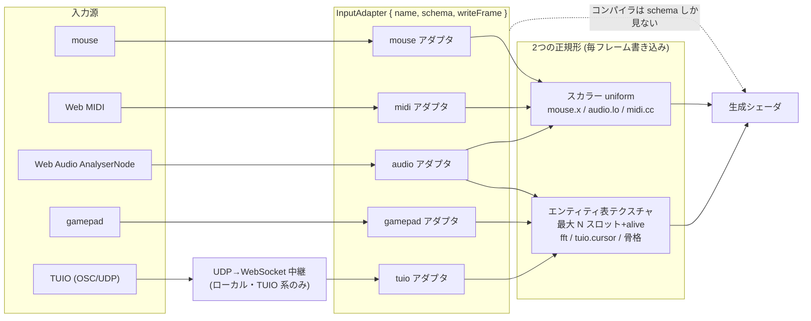
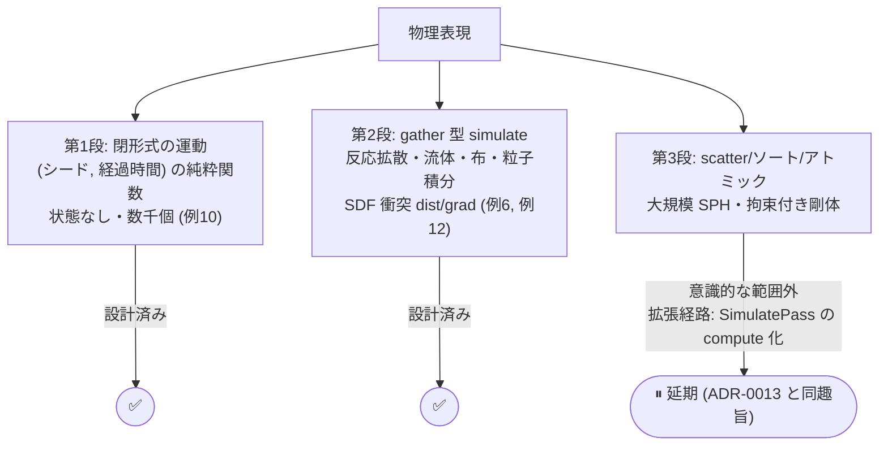
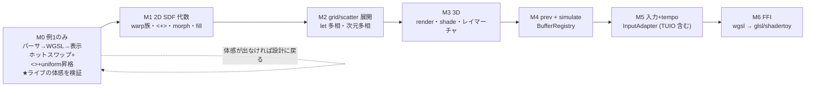

# アーキテクチャ図集(mermaid)

implementation.md / docs/adr/ の設計を図として固定したもの。文章と食い違ったら文章側が正。

## 1. システム全景

3層構造。全部 TypeScript・ブラウザ内(ADR-0006)。

## 2. コンパイルパイプライン(中間表現と最適化)

## 3. 型の流れ(言語のパイプラインは型のパイプライン)

## 4. RenderGraph の例(例12: simulate + 3D + prev + ポスト)

## 5. ホットスワップのシーケンス(ADR-0004, 0010)

## 6. 状態の所有権(「プログラムは使い捨て、状態は永続」)

## 7. 入力の2正規形と InputAdapter(ADR-0012)

## 8. 物理シミュレーションの3段(ADR-0003 追記)

## 9. マイルストーン(垂直に切る)

